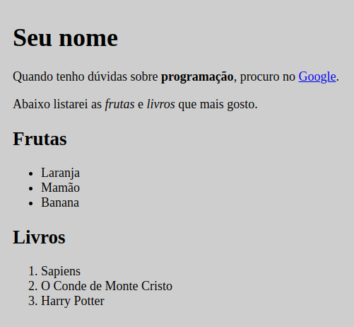

# Exercício
- Criar uma pasta pela interface.
- Abrir no VsCode.
- Criar um arquivo html.
- Inserir estas informações:
    * Um título.
    * Um parágrafo com uma palavra em negrito e um link.
    * Um parágrafo com duas palavras em itálico.
    * Uma lista não ordenada.
    * Uma lista ordenada.

## Exemplo:
